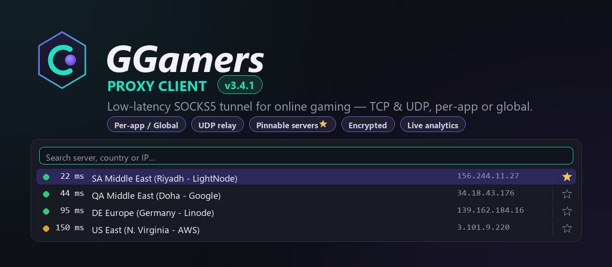

  

<h1 align="center">GGamers Proxy Client</h1>

  <b>Low-latency SOCKS5 tunnel for online gaming — TCP &amp; UDP, per-app or global.</b>

  
  &nbsp;
  

  Windows 10/11 · 64-bit · run as Administrator · ~40&nbsp;MB single file

> **Download the latest build:** click **Download** above (it grabs
> `GGamers-Client.exe` straight from this repo). Older versions are on the
> [Releases](../../releases) page.

---

## Table of contents

1. [What is it?](#what-is-it)
2. [Highlights](#highlights)
3. [Download &amp; run](#download--run)
4. [Routing modes](#routing-modes)
5. [Connecting to a server](#connecting-to-a-server)
6. [Basic vs Advanced](#basic-vs-advanced)
7. [Tuning reference (Advanced)](#tuning-reference-advanced)
8. [Features in depth](#features-in-depth)
9. [The window, tab by tab](#the-window-tab-by-tab)
10. [Live health &amp; analytics](#live-health--analytics)
11. [Updates](#updates)
12. [Privacy &amp; security](#privacy--security)
13. [Troubleshooting](#troubleshooting)
14. [FAQ](#faq)
15. [Legal / safety](#legal--safety)

---

## What is it?

GGamers routes your game — or your whole PC — through a **SOCKS5 proxy**, the
way a gaming VPN would, but with far more control and no virtual adapter. It's
built for **online play and streaming**: a self-healing UDP relay, per-app
routing that never half-tunnels a connection, deep socket tuning, and a clean
UI that stays out of your way.

Point it at any SOCKS5 server (your own, or a subscription like **Mudfish**)
and play. Under the hood it uses the **WinDivert** kernel driver to capture
outbound packets, NATs them to a local listener, and forwards them over SOCKS5
(`CONNECT` for TCP, `UDP ASSOCIATE` for UDP) — no per-app proxy settings, no
browser extensions, no TAP adapter.

## Highlights

- **🎮 Basic or Advanced mode** — pick on first launch. **Basic** is stripped
  down and game-ready (gaming tuning always on, just pick a server and play);
  **Advanced** unlocks everything. Switch anytime from the top-right corner.
- **Three routing modes** — **Global** (whole PC, VPN-style), **Per-app** (only
  the games/apps you choose, matched by exe including child processes), and
  **Proxy Debug** (only apps you launch from inside).
- **TCP &amp; UDP** — full `CONNECT` and `UDP ASSOCIATE`, with a supervised,
  self-healing UDP association. Falls back to TCP-only if your server has no UDP.
- **Subscribed servers** — built-in **Mudfish** server list: fetched, ping-sorted,
  searchable, with **pinnable ★ favourites** that stay on top regardless of ping.
- **Smart bypass** — keep web / voice / streaming / CDN traffic off the proxy so
  only real game traffic is tunneled — in Global *and* Per-app mode.
- **🔎 Test connection** before you Start; **live health** in the status bar;
  **per-app session analytics** when an app stops.
- **Encrypted passwords**, **Windows notifications**, **deep socket tuning**, and
  a full **packet toolbox** (Advanced).

## Download &amp; run

1. Click **⬇ Download** above to get **`GGamers-Client.exe`**.
2. **Right-click → Run as administrator.** The app uses the WinDivert kernel
   driver to capture traffic, which needs elevation. (It requests it
   automatically; approve the UAC prompt.)
3. On first launch, pick **Basic** or **Advanced**.
4. Enter a SOCKS5 server on the **Connection** tab.
5. *(Optional)* Click **🔎 Test connection** to confirm it works.
6. Choose your mode on **Mode / Apps**, then press **Start**.

It's a single portable `.exe` — no installer. It writes its `config.json`,
`subscribed-server.json` and a log next to itself.

> **SmartScreen note:** the download isn't code-signed yet, so Windows may show
> a "Windows protected your PC" prompt — choose **More info → Run anyway**.

## Routing modes

| Mode | Tunnels | Use it for |
|------|---------|------------|
| **Global** | Everything (except LAN, the proxy itself, and web/voice if bypass is on) | Whole-PC, VPN-style |
| **Per-app** | Only the exes you list (and their child processes) | Just your game, nothing else |
| **Proxy Debug** | Only apps you launch from inside the app | Inspecting one app / Charles-Fiddler debugging |

**Why per-app is safe for anti-cheat:** a connection's route is decided **once**
and stuck for its lifetime (no half-tunneling). If a TCP SYN arrives before
Windows has told us which app owns it, GGamers briefly holds it and lets the
kernel retransmit, so the whole connection takes **one consistent path** — a
game server never sees a mid-stream IP change.

## Connecting to a server

On the **Connection** tab the SOCKS5 Server box has two tabs:

- **Custom** — enter host, port, and optional username / password. Recent hosts
  are remembered (passwords encrypted).
- **Subscribed** — a provider list. **Mudfish** is built in: set your
  username / password once, click **↻ Update list** to fetch every node, and it
  pings them all and sorts by latency. Search by name / country / IP, **★ pin**
  your favourites to the top, and **⚡ Ping all** to re-measure without
  re-downloading.

Then optionally hit **🔎 Test connection** — it checks reachability + auth, does
a real `CONNECT` with RTT, a `UDP ASSOCIATE`, and relays real datagrams both
ways — before you press **Start**.

## Basic vs Advanced

Chosen on first launch, switchable anytime from the top-right corner (the button
shows the mode you can switch *to*):

- **🎮 Basic** — game-ready and simple. The **gaming preset is always on**, the
  Tuning and Packet Sender tabs are hidden, and Mode / Apps offers only
  **Per-app**. Just pick a server and add your game.
- **⚙️ Advanced** — everything below is unlocked.

## Tuning reference (Advanced)

**Tuning → 🎮 Apply gaming preset** sets all the recommended options in one
click (this is what Basic mode keeps on permanently). What each option does:

### UDP

| Option | What it does | When to use |
|--------|--------------|-------------|
| **Set Don't-Fragment** | Marks game datagrams DF; the app sizes an MTU guard to the real path so oversized packets are counted &amp; explained, not silently lost. | On for gaming. |
| **DSCP EF (Expedited Forwarding)** | Real QoS marking via the Windows **qWAVE** API (not the ignored `IP_TOS`); the log shows the value actually seen on the wire. | On if your network/router honours DSCP. |
| **Disable WSAECONNRESET** | Stops a stray ICMP "port unreachable" from killing the UDP socket. | On for gaming. |
| **Disable WSAENETRESET** | Sibling of the above for network-reset notifications. | On if you see UDP resets. |
| **Boost relay threads (TIME_CRITICAL)** | Raises the UDP relay threads to the highest scheduling priority. | On for gaming. |
| **Process priority HIGH + 1 ms timer** | Raises the whole app to HIGH priority and switches Windows to a 1 ms scheduler tick while running (reverted on Stop). | On for gaming; costs a little laptop battery. |
| **Inject replies directly** *(experimental)* | Delivers server→app packets straight into the inbound path instead of a loopback hop (self-tests first; falls back if the test packet doesn't arrive). | Optional; shaves ~0.1–0.3 ms per reply. |
| **Auto re-associate on relay silence** | Rebuilds the UDP session if it goes silent while you keep sending. **Keep ON** for servers that kill idle sessions (self-hosted Xray "mixed"); **turn OFF** for a stable pure-SOCKS5 relay (Mudfish) where a brief gap is normal and re-associating would cause a spike. | See note below. |
| **Send / recv buffers, TTL, broadcast** | Standard socket knobs. | Defaults are fine. |

> **Lag-spike tip:** if you get an occasional ~1-second stall on an otherwise
> rock-solid server, turn **Auto re-associate on relay silence** *off*.

### TCP

| Option | What it does |
|--------|--------------|
| **No-delay (disable Nagle)** | Sends small packets immediately instead of coalescing. |
| **Keepalive (idle 30 s)** | Keeps idle connections and NAT mappings alive through lobbies / loading. |
| **DSCP low-latency** | QoS marking for TCP. |
| **Send / recv buffers** | Socket buffer sizes. |

### Mobile / lossy-link enhancer (Per-app only)

Off by default (with a confirm dialog). For **high jitter / packet-loss links**
(3G/LTE, congested Wi-Fi) it can duplicate outbound game datagrams:

- **Staggered duplication** — dup copies spaced a few ms apart so one burst of
  loss can't take them all.
- **Adaptive duplication** — automatically sends ×2 for ~20 s whenever the proxy
  hop shows loss or a chatty server goes quiet.

Don't enable it on a clean connection — it just doubles your upload for nothing.

## Features in depth

- **Self-healing UDP** — a keepalive after idle so your NAT mapping survives
  lobbies; a watcher that re-runs `UDP ASSOCIATE` with back-off if the server
  drops it; and, for the rare true session death, a STUN-based verdict logged so
  you can tell a server-side drop from a NAT remap.
- **Smart bypass** — with **Bypass web / voice / streaming** on, web / CDN /
  telemetry traffic (TCP 80/443, UDP 443 QUIC, WebSocket) goes **direct** so
  your proxy quota is spent only on latency-sensitive game traffic. Works in
  **Global and Per-app** mode. In Global it also bypasses browsers, voice apps
  (Discord/TeamSpeak), remote-desktop/streaming (Parsec, AnyDesk, OBS) and mesh
  VPNs (ZeroTier, Tailscale) by exe name.
- **DNS control** — optionally tunnel DNS to a resolver of your choice, with
  per-query logging (muted by default). IPv6 passes through untouched so Xbox
  Live / Teredo keeps working.
- **Tunneled-app icons** — the Mode / Apps list shows each app's real Windows
  icon and remembers it, so it's recognisable even when the app is closed. The
  list locks while the proxy runs so you can't remove an app mid-session.
- **Packet toolbox** *(Advanced, Packet Sender tab)* — live capture with
  protocol decoders, a WebSocket / raw sender, live packet-**rewrite rules**,
  and a conversation **recorder / replay**.

## The window, tab by tab

- **Connection** — SOCKS5 server (Custom / Subscribed), protocol (UDP relay,
  TCP-only), bypass options, DNS, Test connection.
- **Tuning** *(Advanced)* — the gaming preset + all TCP/UDP knobs above.
- **Mode / Apps** — Global / Per-app / Proxy Debug, and the per-app / debug app
  lists.
- **Packet Sender** *(Advanced)* — the packet toolbox.
- **Log** — live log, bandwidth graph, proxy-ping wave, long-lived connections,
  and mute toggles (DNS lines, notifications).
- **About** — version and links.

## Live health &amp; analytics

- **Status bar** — a real **5-second proxy ping** with running **min / avg /
  max**, UDP association state and reconnect count, ↑↓ throughput, active flows,
  and MTU drops. The same text is in the tray tooltip; a latency **wave** on the
  Log tab shows the live value.
- **Per-app session analytics** — when a proxied app stops, the Log prints a
  summary of that session: data up / down / total, packets, latency min·avg·max,
  jitter, worst reply gap, and hiccups (UDP reconnects, MTU drops) — so you can
  spot problems and tune.
- **Windows notifications** — you're told (by app name) when a selected app
  starts and stops being proxied. Mutable on the Log tab.

## Updates

On startup the app checks this repo for a newer release:

- A **major or minor** update (e.g. 3.4.x → 3.5.0) is **mandatory** — the app is
  locked until you install it.
- A **patch** update (e.g. 3.4.0 → 3.4.1) is a **recommended** note you can mute
  per version.
- If GitHub can't be reached, the app stays usable (it never locks you out
  offline).

## Privacy &amp; security

- **Passwords are encrypted at rest** with Windows **DPAPI**, tied to your
  Windows account — never stored in plaintext, and useless if the config file is
  copied to another machine. Password fields are modify-only (you can't copy the
  value back out).
- The app talks only to the **proxy server you configure** and — on startup — to
  **GitHub** for the update check. Nothing else.
- Config, subscription and log files live **next to the exe**; delete the folder
  to remove everything.

## Troubleshooting

- **"Must run as Administrator"** — right-click the exe → *Run as administrator*.
- **A random ~1-second lag spike** on a stable server (Mudfish etc.) — turn
  **off** *Auto re-associate on relay silence* in **Tuning → UDP**.
- **Game's 443 traffic still going through the proxy** — tick **Bypass web /
  voice / streaming** on the Connection tab (works in Per-app mode too).
- **Notifications don't appear** — enable notifications for the app in Windows
  Settings and turn off Focus Assist / Do-Not-Disturb.
- **"Update required" on launch** — a newer major/minor release is out; download
  it from the button at the top of this page.

## FAQ

**Does it need a specific proxy?** Any SOCKS5 server works (yours or a
subscription like Mudfish). UDP needs a server that supports `UDP ASSOCIATE`; if
not, use TCP-only mode.

**Will it get me VAC/anti-cheat banned?** It's a network router, not a game
hook — but you are responsible for following each game's terms. Per-app mode is
designed to never half-tunnel a connection.

**Is it a VPN?** In Global mode it behaves like a userspace VPN over SOCKS5. It
does not encrypt by itself — encryption depends on your proxy.

**Portable?** Yes — one exe, all settings kept beside it.

## Legal / safety

Use GGamers only with proxy servers you own or are authorised to use, and in
line with each game's terms of service. This is a networking tool provided
**as-is, without warranty**; you are responsible for how you use it.

---

© GGamers · <a href="https://GGamers.net">GGamers.net</a>

