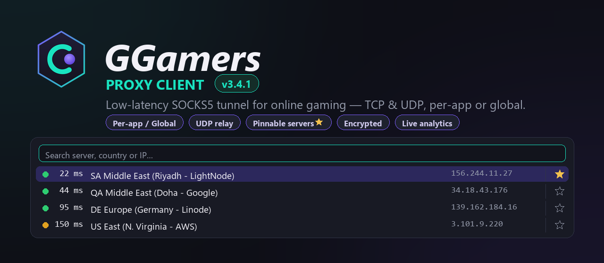

  

<h1 align="center">GGamers Proxy Client</h1>

  <b>Low-latency tunnel for online gaming — SOCKS5 &amp; TUIC v5 (QUIC), TCP &amp; UDP, per-app or global.</b>

  
  &nbsp;
  

  Windows 10/11 · 64-bit · single self-contained file · runs as Administrator

> **Download the latest build:** click **Download** above (it grabs
> `GGamers-Client.exe` straight from this repo). Older versions are on the
> [Releases](../../releases) page.

---

## Table of contents

1. [What is it?](#what-is-it)
2. [Highlights](#highlights)
3. [Requirements](#requirements)
4. [Install &amp; first run](#install--first-run)
5. [Quick start](#quick-start)
6. [The app, tab by tab](#the-app-tab-by-tab)
7. [How it works](#how-it-works)
8. [Updating](#updating)
9. [Troubleshooting](#troubleshooting)
10. [Credits](#credits)

---

## What is it?

A Windows desktop app that transparently routes your traffic through a remote
server — **all of it** (VPN-style), **only the apps you pick** (your game, your
browser), or **only what you launch from inside the app** — with no per-app proxy
settings, no browser extensions and no virtual network adapter.

It's built for **online gaming**: low-latency TCP **and** UDP, a self-healing UDP
relay that survives router/CGNAT idle timeouts, deep socket tuning, and a
per-flow engine that never half-tunnels a connection (which is what gets you
flagged on anti-cheat servers).

**Version 4.0.0 is a full rewrite in C# / .NET** — the older Python build could
briefly stutter or hang the machine mid-game; this one runs natively with none of
that.

---

## Highlights

- **Two transports:**
  - **SOCKS5** — Custom (host / port / user / pass) or **Subscribed** (auto-fetch
    your server list and ping them, pick the fastest).
  - **TUIC v5 (QUIC)** — paste a `tuic://` share link; a bundled client dials your
    server over QUIC with native UDP relay + BBR congestion control. Great for games.
- **Three modes:** **Global** (everything), **Per-app** (only apps you select — with
  icons; double-click to add/remove), **Proxy Debug** (only what you launch).
- **Self-healing UDP relay** — keepalives + automatic re-association so a game
  never silently loses its connection after a few minutes idle in a lobby.
- **Live Connections view** — every connection with its **app icon**, destination,
  a **TUNNEL / DIRECT** badge, ping, jitter, packets and bytes, plus a **live
  up/down bandwidth graph** with session totals.
- **Tuning** — TCP/UDP low-latency options with a one-click **gaming preset**.
- **Quality-of-life** — Dark / Light themes, minimise-to-tray, start-with-Windows,
  a desktop notification when one of your apps starts tunneling, and a built-in
  **updater**.
- **Single self-contained `GGamers.exe`** — nothing to install alongside it.

---

## Requirements

- **Windows 10 or 11, 64-bit.**
- **Administrator** — the app uses a kernel network driver (WinDivert) to capture
  traffic, so Windows shows a **UAC prompt** each time it starts. That's normal
  and required; just click **Yes**.

That's it — **no .NET runtime to install** and no other prerequisites. The .NET
runtime, the network driver and the TUIC client are all bundled inside the one exe.

---

## Install &amp; first run

1. **Download** `GGamers-Client.exe` (button above) and run it.
2. It installs itself into `%LOCALAPPDATA%\GGamers`, creates Desktop + Start-menu
   shortcuts (optionally pins to Start), and launches.
3. Running the downloaded file again later shows **Repair / Uninstall / Open**.

Your settings live in the install folder and are kept across updates.

---

## Quick start

1. Open the **Connection** tab and choose a server:
   - **Custom SOCKS5** — type host, port and (optional) username/password, or
   - **Subscribed SOCKS5** — press **Refresh list**, then pick the fastest server, or
   - **TUIC v5** — press **📋 Paste from clipboard** with a `tuic://` link copied.
2. (Optional) **Test connection** to confirm the server answers.
3. Pick a **mode** on **Mode &amp; Apps** — for gaming, **Per-app** and double-click
   your game to add it.
4. Press **▶ Start** (accept the UAC prompt). The button turns into **■ Stop**.
5. Watch the **Connections** tab to see your game tunneling.

While it's running the connection / mode / tuning settings are locked so nothing
conflicting changes mid-session — press **Stop** to change them.

---

## The app, tab by tab

- **Connection** — pick your server (Custom / Subscribed / TUIC), protocol
  (UDP relay for games, or TCP-only), and options (bypass web, bypass LAN,
  tunnel DNS). **Test connection** checks it end-to-end.
- **Mode &amp; Apps** — Global / Per-app / Debug, and the app pickers (with icons;
  double-click to add or remove).
- **Connections** — live tunnel activity, the bandwidth graph and the
  *Show direct connections* toggle.
- **Tuning** — TCP/UDP low-latency options and the one-click gaming preset (it
  greys out when your settings already match it).
- **Log** — what the engine is doing, and connection-test results.
- **About** — version, links, and **Check for updates**.

---

## How it works

Your outbound packets are captured by the **WinDivert** kernel driver, NAT'd to a
local listener, and forwarded to your server — over **SOCKS5** (`CONNECT` for TCP,
`UDP ASSOCIATE` for UDP), or through a **bundled TUIC client** that carries
everything inside a single QUIC tunnel. Replies are rewritten on the way back so
your apps only ever see the real remote peer. A sticky per-flow decision means a
connection is either fully tunneled or fully direct — never split.

---

## Updating

Open **About → Check for updates**. If a newer version is published it downloads,
replaces the app and relaunches. You can also just re-download `GGamers-Client.exe`
from here any time.

---

## Troubleshooting

- **No UAC prompt / won't start** — it must run as Administrator; right-click →
  *Run as administrator*.
- **"Server unreachable" / Test fails** — double-check host/port (and for TUIC,
  that the `tuic://` link is exactly the one from your panel), and that the server
  is up.
- **Game connects but lobby/join fails on a QUIC transport** — turn **bypass web
  off** and use **Per-app** mode, so downloads and gameplay share one exit IP.
- **UDP not working** — some servers don't support UDP relay; the app falls back
  to TCP-only automatically (shown in the Log).

---

## Credits

Made by **Yakuza** — [GGamers.net](https://GGamers.net) ·
Telegram [@Yakuza4](https://t.me/Yakuza4) · Snapchat
[@yakuuo](https://www.snapchat.com/add/yakuuo). Made by gamers for gamers ❤️

Free for personal use. The author is not responsible for any ToS violations
resulting from proxy use in online services.
